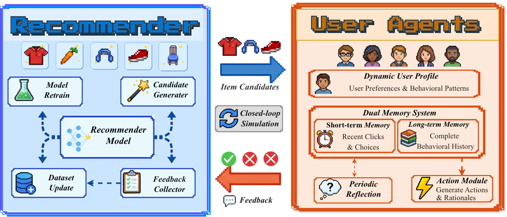

<h1 align="center">Do Generative Recommenders Deepen the Information Cocoon?</h1>
<h3 align="center"><b>A Closed-Loop Simulation with LLM-Powered Agents</b></h3>


## Overview


Recommender systems are increasingly linked to the formation of information cocoons, where algorithmic personalization narrows content exposure at both the individual and collective levels.
While this phenomenon has been studied extensively for traditional recommendation algorithms, a new paradigm, generative recommendation, remains largely unexamined: these models replace embedding-based scoring with autoregressive generation over learned hierarchical code spaces; whether and how these structural properties shape content diversity over time is unknown.
We explore this with **RecLoop**, a closed-loop simulation framework in which LLM-powered user agents interact with generative and traditional sequential recommenders over 15 feedback cycles with periodic model retraining.

## News

**[2025/05]** We release  ReLoop, A Closed-Loop Simulation with LLM-Powered Agents.

## Quick Start

### Installation

Make sure `uv` is installed in your environment.

```bash
uv sync
```
### Prepare Dataset

Download the 5-core reviews and metadata for your target dataset from [Amazon Reviews 2014](https://cseweb.ucsd.edu/~jmcauley/datasets/amazon/links.html) into `recommenders/data/Amazon2014/`.

| Dataset | 5-core Reviews | Metadata |
| --- | --- | --- |
| `Office_Products` | [reviews_Office_Products_5.json.gz](https://snap.stanford.edu/data/amazon/productGraph/categoryFiles/reviews_Office_Products_5.json.gz) | [meta_Office_Products.json.gz](https://snap.stanford.edu/data/amazon/productGraph/categoryFiles/meta_Office_Products.json.gz) |
| `Toys_and_Games` | [reviews_Toys_and_Games_5.json.gz](https://snap.stanford.edu/data/amazon/productGraph/categoryFiles/reviews_Toys_and_Games_5.json.gz) | [meta_Toys_and_Games.json.gz](https://snap.stanford.edu/data/amazon/productGraph/categoryFiles/meta_Toys_and_Games.json.gz) |

```bash
mkdir -p recommenders/data/Amazon2014
cd recommenders/data/Amazon2014
wget https://snap.stanford.edu/data/amazon/productGraph/categoryFiles/reviews_Office_Products_5.json.gz
wget https://snap.stanford.edu/data/amazon/productGraph/categoryFiles/meta_Office_Products.json.gz
```

Then run the preprocessing script:

```bash
cd recommenders/data
uv run process2014.py --dataset Office_Products
```

### Generate User Profiles

First, configure the `simulation/api_config.json` file with your own API credentials.

```bash
uv run simulation/user_profile_extractor.py --dataset Office_Products
```


### Run Traditional Recommender Simulation

```bash
bash simulation/run_simulation_round_traditional.sh
```

### Run Tiger Generative Recommender Simulation

```bash
bash simulation/run_simulation_round_generative_tiger.sh
```

### Run OneRec Generative Recommender Simulation

OneRec requires a separate conda environment and an additional data preprocessing step.

First, create the conda environment from the provided configuration file:

```bash
conda env create -f environment.yml
```

Then, run the OneRec-specific data preprocessing script:

```bash
uv run recommenders/generativerec_onerec/data/process2014.py --dataset Office_Products
```

Finally, modify the `$PYTHON` variable in `simulation/generative_recommend_onerec.sh` to point to the Python interpreter of your newly created conda environment (e.g., `/path/to/your/conda/envs/recloop/bin/python`).

```bash
bash simulation/run_simulation_round_generative_onerec.sh
```

## Todo

- [ ] Add usage tutorials for metric calculation scripts
- [ ] Add support for more generative recommendation paradigms
## Acknowledgments

We thank the authors of the following open-source repositories for making their code publicly available, which we use in this project:

- [EasySeqRec](https://github.com/Lyz103/EasySeqRec) — provides SASRec, Mamba4Rec, and other sequential recommendation models
- [MiniOneRec](https://github.com/AkaliKong/MiniOneRec) — provides the OneRec generative recommender
- [Liger](https://github.com/facebookresearch/liger) — provides the TIGER generative recommender

If you find any issues or have suggestions, please feel free to open an issue or submit a pull request. We welcome all contributions!

## License

This project is licensed under the Apache License 2.0. For more details, please refer to the [LICENSE](LICENSE) file in the repository.

## Citation

If you find our framework and paper useful, we appreciate it if you could cite our work:

